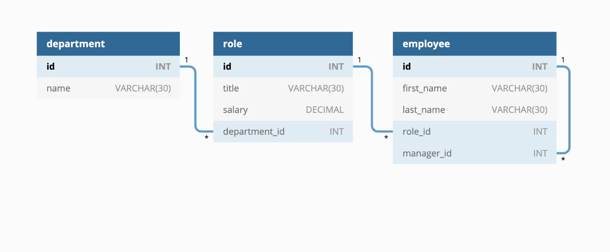
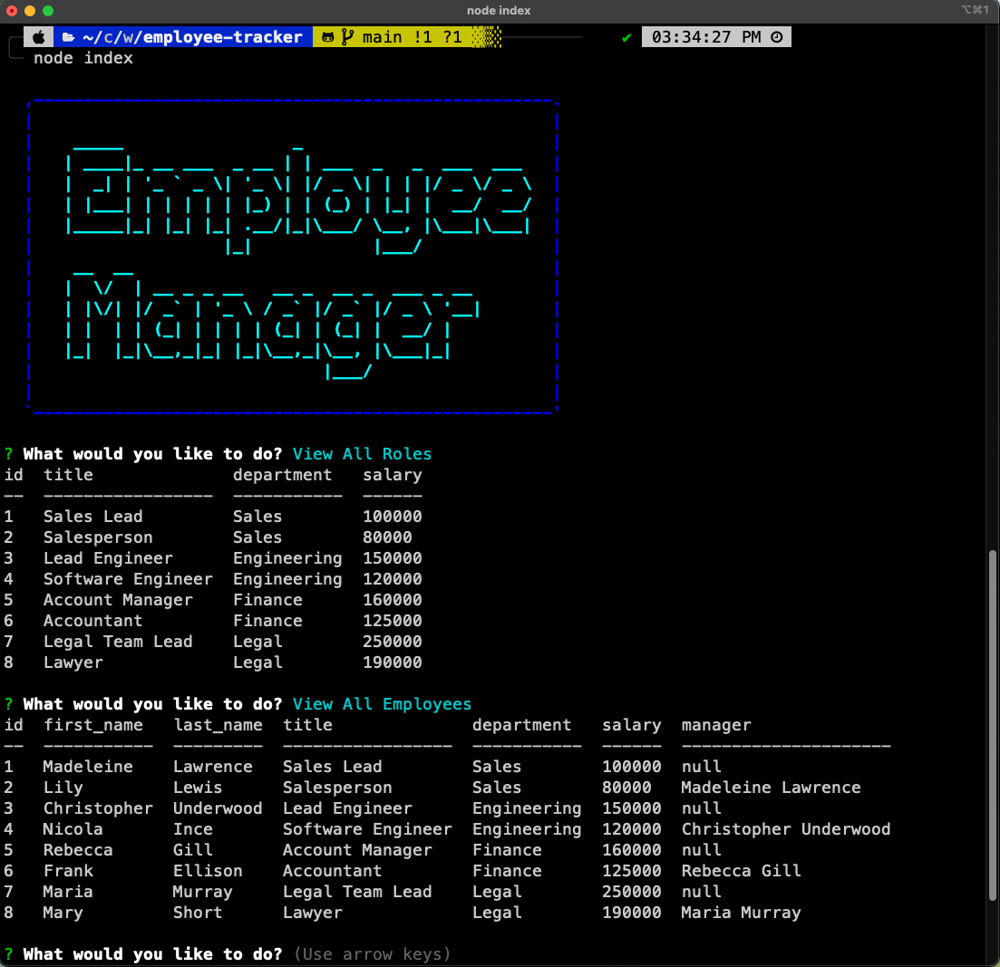

# Employee Tracker

## Badges:
---


[](https://svgshare.com/i/ZjP.svg)

## Table of Contents:

---

- [Description](#description)
- [Installation](#installation)
- [Usage](#usage)
- [Demo](#demo)
- [License](#license)
- [Questions](#questions)

## Description:

---

This application is created for business owners to be able to view and manage the departments, roles, and employees in their companies so that they can easily organize and plan their business. It is built using Node.js, Inquirer, and MySQL.

## Installation:

---

To install this app, make sure to run:

```
npm i
```
Before running the app, you need to run the schema and seeds file so you will have a starting database to work with. Make sure to log into mysql and then key:
```
source db/schema.sql
source db/seeds.sql
```

## Usage:

---

After you run npm i, you should have all the dependencies that are needed to use the app. Simply run the following command to start the app:

```
node index.js
```

## Demo :

---
The database schema as shown in the following image:



The command-line application using Node.js, Inquirer, and MySQL:



[Click here to watch the demo on Screencastify!](https://drive.google.com/file/d/1rkTnSc0OGjL4_A1vY9j8mV6DBQL4sn9p/view)

## License:

---


## Questions:

---

If you have any questions, you may contact me at either <br>
Github: https://github.com/daisyle0203
<br>
or
<br>
Email: daisy.le0203@gmail.com

---

[Top of Page](#employee-tracker)